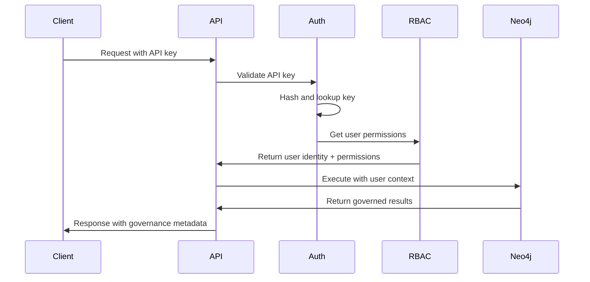
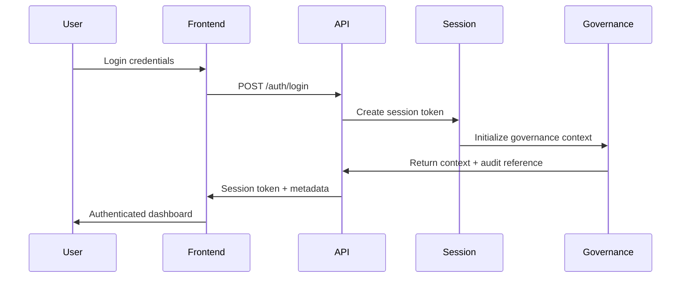

# MAHOUN Authentication & Authorization System

**Classification:** MANDATORY SECURITY DOCUMENTATION  
**Version:** 1.0.0  
**Status:** Normative  
**Last Updated:** 2026-08-06  

---

## Identity Model

### User Identity Structure

MAHOUN implements a **multi-layered identity system** combining API keys with role-based access control (RBAC):

```typescript
interface UserIdentity {
  // Primary Identity
  username: string;           // Unique user identifier
  user_id: string;           // Internal UUID
  
  // Authentication Layers
  api_key?: string;          // API key (prefixed: mhn_*)
  session_token?: string;    // Session-based authentication
  
  // Authorization Context
  role: Role;               // Primary role (admin, analyst, viewer, api_user)
  permissions: Permission[]; // Granular permissions
  
  // Governance Integration
  governance_context: {
    request_id: string;      // Request correlation ID
    trace_id: string;        // Distributed tracing ID
    audit_reference: string; // Immutable audit trail reference
  };
  
  // Metadata
  metadata: Record<string, any>;
  created_at: string;
  last_accessed: string;
}
```

### Authentication Methods

| Method | Use Case | Implementation | Status |
|--------|----------|---------------|--------|
| **API Keys** | Service-to-service, automation | `mahoun.security.api_keys.APIKeyManager` | ✅ Active |
| **Session-based** | Interactive web sessions | FastAPI middleware | ✅ Active |
| **Neo4j Auth** | Database access | Integrated with RBAC | ✅ Active |
| **JWT Tokens** | Stateless authentication | Future enhancement | 🔄 Planned |

---

## Roles

### Role Hierarchy

```yaml
roles:
  admin:
    level: 4
    description: "System administrator with full access"
    inheritance: [analyst, viewer, api_user]
    
  analyst:
    level: 3  
    description: "Legal analyst with write access"
    inheritance: [viewer]
    
  viewer:
    level: 2
    description: "Read-only access to legal data"
    inheritance: []
    
  api_user:
    level: 1
    description: "Programmatic access via API"
    inheritance: []
```

### Role Definitions

#### **Administrator (admin)**
- **Purpose:** System administration and platform governance
- **Access Level:** Full system access
- **Typical Users:** Platform administrators, DevOps teams
- **Key Responsibilities:**
  - User management and role assignment
  - System configuration and monitoring
  - Governance policy management
  - Audit trail access and compliance reporting

#### **Legal Analyst (analyst)**
- **Purpose:** Legal research and case analysis
- **Access Level:** Read and write access to legal content
- **Typical Users:** Legal professionals, researchers, case managers
- **Key Responsibilities:**
  - Legal document analysis and reasoning
  - Knowledge graph updates and curation
  - Evidence validation and citation management
  - Legal precedent research

#### **Viewer (viewer)**
- **Purpose:** Read-only access to legal information
- **Access Level:** Query and view legal content
- **Typical Users:** Students, junior staff, auditors
- **Key Responsibilities:**
  - Legal research queries
  - Report generation and export
  - Basic analytics and statistics

#### **API User (api_user)**
- **Purpose:** Programmatic integration and automation
- **Access Level:** Structured API access
- **Typical Users:** External systems, integrations, automated workflows
- **Key Responsibilities:**
  - Automated legal queries
  - Data synchronization
  - Bulk operations and reporting

---

## Permissions

### Permission Matrix

| Permission | admin | analyst | viewer | api_user | Description |
|-----------|-------|---------|--------|----------|-------------|
| **read** | ✅ | ✅ | ✅ | ✅ | Query legal database and view results |
| **write** | ✅ | ✅ | ❌ | ✅ | Create and update legal content |
| **delete** | ✅ | ❌ | ❌ | ❌ | Remove legal content and records |
| **admin** | ✅ | ❌ | ❌ | ❌ | System administration functions |
| **export** | ✅ | ✅ | ✅ | ❌ | Export reports and data |
| **anonymize** | ✅ | ❌ | ❌ | ❌ | Anonymize sensitive data |

### Granular Permissions

```python
class Permission(str, Enum):
    # Core Access
    READ = "read"                    # Query and view legal content
    WRITE = "write"                  # Create and update content  
    DELETE = "delete"                # Remove content
    
    # Administrative
    ADMIN = "admin"                  # System administration
    USER_MANAGEMENT = "user_mgmt"    # Manage users and roles
    
    # Data Operations
    EXPORT = "export"                # Export reports and data
    ANONYMIZE = "anonymize"          # Data anonymization
    BULK_IMPORT = "bulk_import"      # Bulk data operations
    
    # Advanced Features
    GOVERNANCE = "governance"        # Access governance controls
    AUDIT_ACCESS = "audit_access"    # View audit logs
    SYSTEM_CONFIG = "system_config"  # Modify system configuration
```

### Permission Enforcement

Permissions are enforced at multiple levels:

1. **API Layer:** FastAPI dependency injection with `@require_permission()`
2. **Service Layer:** Business logic permission checks
3. **Database Layer:** Neo4j role-based database access
4. **Governance Layer:** Constitutional compliance validation

---

## Authentication Flow

### 1. API Key Authentication Flow



### 2. Interactive Session Flow



### 3. Neo4j Database Authentication

```python
def setup_neo4j_user_auth(username: str, role: Role) -> bool:
    """
    Map application roles to Neo4j database roles
    Integrated with mahoun.security.rbac.RBACManager
    """
    neo4j_role_mapping = {
        Role.ADMIN: 'admin',      # Full database access
        Role.ANALYST: 'editor',   # Read/write access  
        Role.VIEWER: 'reader',    # Read-only access
        Role.API_USER: 'editor',  # Programmatic access
    }
    
    # Create Neo4j user with mapped role
    neo4j_role = neo4j_role_mapping[role]
    connection.execute_query(f"CREATE USER {username} SET PASSWORD CHANGE NOT REQUIRED")
    connection.execute_query(f"GRANT ROLE {neo4j_role} TO {username}")
```

---

## Integration with Frontend

### Authentication Headers

All API requests must include authentication:

```typescript
// API Key Authentication  
const headers = {
  'Authorization': 'Bearer mhn_<api_key>',
  'Content-Type': 'application/json',
  'X-Request-ID': generateRequestId(),
};

// Session Authentication
const headers = {
  'Authorization': 'Session <session_token>',
  'Content-Type': 'application/json',
  'X-Request-ID': generateRequestId(),
};
```

### Frontend Authentication State

```typescript
interface AuthState {
  isAuthenticated: boolean;
  user: UserIdentity | null;
  token: string | null;
  permissions: Permission[];
  
  // Governance Integration
  governanceContext: {
    requestId: string;
    traceId: string;
    auditReference: string;
  };
}

// Zustand store for authentication
export const useAuthStore = create<AuthState>((set) => ({
  isAuthenticated: false,
  user: null,
  token: null,
  permissions: [],
  
  login: async (credentials) => {
    const response = await api.post('/auth/login', credentials);
    const { user, token, governanceContext } = response.data;
    
    set({
      isAuthenticated: true,
      user,
      token,
      permissions: user.permissions,
      governanceContext,
    });
  },
  
  logout: () => {
    set({
      isAuthenticated: false,
      user: null,
      token: null,
      permissions: [],
    });
  },
}));
```

### Protected Routes

```typescript
// Route protection based on permissions
export const ProtectedRoute: React.FC<{
  children: React.ReactNode;
  requiredPermission: Permission;
}> = ({ children, requiredPermission }) => {
  const { permissions } = useAuthStore();
  
  if (!permissions.includes(requiredPermission)) {
    return <UnauthorizedPage />;
  }
  
  return <>{children}</>;
};
```

---

## Security Features

### API Key Security

1. **Cryptographic Generation:** Using `secrets.token_urlsafe(32)` for 256-bit entropy
2. **Secure Hashing:** SHA-256 hashing before storage (never store raw keys)
3. **Key Rotation:** Automated and manual key rotation support
4. **Rate Limiting:** Per-key rate limits with configurable thresholds
5. **Usage Tracking:** Comprehensive audit logs for all key usage

### Session Security

1. **Secure Headers:** CORS, CSRF protection, and trusted host validation
2. **Session Expiry:** Configurable session timeouts and refresh tokens  
3. **Concurrent Sessions:** Optional limit on simultaneous sessions per user
4. **Audit Trails:** Complete session lifecycle logging

### Governance Integration

Every authenticated request includes:

```json
{
  "governance_metadata": {
    "request_id": "req_abc123def456",
    "trace_id": "trace_789xyz012",
    "audit_reference": "audit_2026_08_06_001234",
    "user_identity": {
      "username": "analyst_01",
      "role": "analyst", 
      "permissions": ["read", "write", "export"]
    },
    "timestamp": "2026-08-06T10:30:45Z"
  }
}
```

---

## Configuration

### Environment Variables

```bash
# Authentication Settings
MAHOUN_AUTH_METHOD=api_key              # api_key | session | both
MAHOUN_SESSION_TIMEOUT=3600             # Session timeout in seconds
MAHOUN_API_KEY_PREFIX=mhn_              # API key prefix
MAHOUN_REQUIRE_HTTPS=true               # Enforce HTTPS in production

# RBAC Settings  
MAHOUN_DEFAULT_ROLE=viewer              # Default role for new users
MAHOUN_ROLE_INHERITANCE=true            # Enable role inheritance
MAHOUN_PERMISSION_CACHING=true          # Cache permission lookups

# Security Hardening
MAHOUN_RATE_LIMIT_ENABLED=true          # Enable rate limiting
MAHOUN_RATE_LIMIT_REQUESTS=100          # Requests per window
MAHOUN_RATE_LIMIT_WINDOW=60             # Rate limit window (seconds)
MAHOUN_CORS_ENABLED=true                # Enable CORS middleware
```

### Production Deployment

1. **HTTPS Only:** All authentication must use HTTPS in production
2. **Key Management:** Use external key management systems (AWS KMS, HashiCorp Vault)
3. **Database Security:** Neo4j authentication with encrypted connections
4. **Monitoring:** Real-time authentication monitoring and alerting
5. **Compliance:** Full audit trails for regulatory compliance (GDPR, SOX, etc.)

---

## API Endpoints

### Authentication Endpoints

```yaml
endpoints:
  # Session Authentication
  POST /api/auth/login:
    description: "Create authenticated session"
    request: { username: string, password: string }
    response: { token: string, user: UserIdentity, expires_at: string }
  
  POST /api/auth/logout:
    description: "Terminate session"
    headers: { Authorization: "Session <token>" }
    response: { status: "logged_out" }
  
  GET /api/auth/me:
    description: "Get current user identity"
    headers: { Authorization: "Bearer <api_key>" | "Session <token>" }
    response: { user: UserIdentity, permissions: Permission[] }
  
  # API Key Management
  POST /api/auth/keys:
    description: "Generate new API key"
    permission: "admin"
    request: { name: string, permissions: Permission[], expires_in_days?: number }
    response: { api_key: string, key_id: string }
  
  DELETE /api/auth/keys/{key_id}:
    description: "Revoke API key"
    permission: "admin"
    response: { status: "revoked" }
```

---

## Compliance & Auditing

### Audit Requirements

All authentication events are logged with:

1. **Identity Information:** Username, role, permissions
2. **Request Context:** IP address, user agent, request ID
3. **Governance Context:** Trace ID, audit reference, provenance
4. **Temporal Data:** Timestamp, session duration, expiry
5. **Security Events:** Failed attempts, suspicious activity, rate limiting

### Regulatory Compliance

- **GDPR:** Personal data protection and right to erasure
- **SOX:** Financial data access controls and audit trails  
- **HIPAA:** Healthcare information security (if applicable)
- **Iranian Data Protection:** Local compliance requirements

---

## Implementation References

### Core Classes

```python
# Authentication Management
mahoun.security.api_keys.APIKeyManager          # API key generation and validation
mahoun.security.rbac.RBACManager                # Role-based access control

# Governance Integration  
mahoun.core.governance.governance_context        # Authentication governance context
api.middleware.governance_context                # Request-level governance middleware

# FastAPI Integration
api.main.apply_security_middleware               # CORS, trusted hosts, rate limiting
```

### Database Schema

```cypher
// Neo4j User Management
CREATE CONSTRAINT user_username_unique FOR (u:User) REQUIRE u.username IS UNIQUE;
CREATE CONSTRAINT api_key_id_unique FOR (k:APIKey) REQUIRE k.key_id IS UNIQUE;

// Role and Permission Relationships
CREATE (u:User)-[:HAS_ROLE]->(r:Role)
CREATE (r:Role)-[:HAS_PERMISSION]->(p:Permission)
```

---

## Future Enhancements

1. **Multi-Factor Authentication (MFA):** TOTP, SMS, hardware keys
2. **Single Sign-On (SSO):** SAML, OAuth 2.0, OpenID Connect
3. **Advanced RBAC:** Attribute-based access control (ABAC)
4. **Risk-Based Authentication:** Behavioral analytics and risk scoring
5. **Zero Trust Architecture:** Continuous authentication and authorization

---

*This document is part of the MAHOUN Constitutional Framework and is subordinate to `mahoun/constitutional/constitution/CONSTITUTION.md` for all governance matters.*