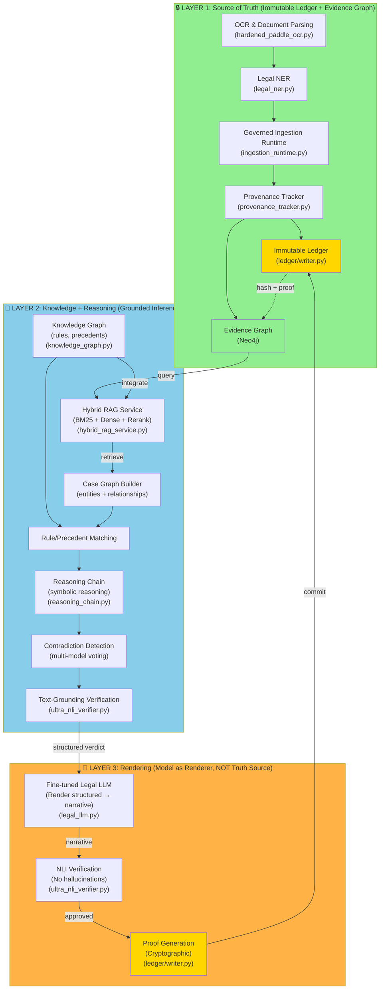

# معماری سه‌لایه‌ای MAHOUN: حقیقت ← استدلال ← تولید
**Source: Ground Truth Architecture for Legal Case Analysis**

---

## 🎯 مقدمه

سیستم MAHOUN برای بررسی پرونده‌های قانونی بزرگ (چند هزار صفحه)، سه لایه معماری دارد:

1. **Layer 1 (حقیقت)**: لجر غیرقابل‌تغییر + گراف شواهد + Provenance
2. **Layer 2 (استدلال)**: دانش حقوقی + رجع‌گیری + استدلال نمادین
3. **Layer 3 (تولید)**: مدل فاین‌تیون‌شده + تحقق NLI



---

## 📊 تفصیل هر لایه

### 🔒 Layer 1: Source of Truth (مرجع حقیقت)

**مسئولیت**: تضمین اینکه تمام شواهد و اطلاعات قابل‌اثبات، غیرقابل‌تغییر و دارای provenance هستند.

#### اجزاء:

| جزء | فایل | نقش |
|-----|------|------|
| **OCR Hardened** | `mahoun/pipelines/ingestion/hardened_paddle_ocr.py` | استخراج متن از تصاویر با checkpoint/resume |
| **Legal NER** | `mahoun/pipelines/ingestion/legal_ner.py` | شناسایی entities حقوقی (قرارداد، طرف‌ها، تاریخ‌ها) |
| **Governed Ingestion** | `mahoun/core/governance/ingestion_runtime.py` | وارد کردن داده‌ها با GovernanceContextManager |
| **Provenance Tracker** | `mahoun/core/governance/provenance_tracker.py` | تسجیل: منبع، نویسنده، timestamp، governance_scope_id |
| **Immutable Ledger** | `mahoun/ledger/writer.py` | ثبت atomic با EvidencePackage (proof_hash + evidence_refs) |
| **Evidence Graph** | Neo4j | گراف نودی برای شواهد، روابط، و متاداتا |

#### جریان ورود داده:

```
📄 Document Input (e.g., 5000 pages)
   ↓
🖼️  OCR (Extract text with merkle-tree integrity)
   ↓
🏷️  Legal NER (Extract: Company A, Company B, Clause X, Date Y)
   ↓
🔐 Governed Ingestion (within GovernanceContextManager.active_context())
   ↓
📜 Provenance Capture (author=SYSTEM_ACTOR, source=pdf_ingestion, correlation_id=uuid)
   ↓
✍️  Ledger Write (atomic commit: proof_hash + evidence_refs)
   ↓
📊 Evidence Graph Update (Neo4j nodes + relationships)
   ↓
🔒 IMMUTABLE: Proof + Attestation stored
```

#### نمونه EvidencePackage:

```python
EvidencePackage(
    evidence_refs=[
        EvidenceRef(document_id="doc_12345", page=42, line_number=15),
        EvidenceRef(document_id="doc_12345", page=43, line_number=1),
    ],
    provenance_chain=[
        Provenance(
            source="pdf_ingestion",
            author="SYSTEM_ACTOR_DOCUMENT_PROCESSOR",
            timestamp="2026-08-18T05:23:13Z",
            governance_scope_id="ctx-abc123",
        )
    ],
    proof_hash="sha256:deadbeef...",  # Merkle-tree hash of entire package
)
```

**اصل**: هیچ چیز بدون provenance و proof_hash وارد سیستم نمی‌شود.

---

### 🧠 Layer 2: Knowledge + Reasoning (لایه دانش و استدلال)

**مسئولیت**: استخراج معنا، قانون‌ها و روابط حقوقی از شواهد، سپس استدلال نمادین برای تولید verdict ساختار‌یافته.

#### اجزاء:

| جزء | فایل | نقش |
|-----|------|------|
| **Knowledge Graph** | `mahoun/reasoning/knowledge_graph.py` | قوانین، precedents، روابط حقوقی |
| **Hybrid RAG** | `mahoun/rag/hybrid_rag_service.py` | رجع‌گیری هجین: BM25 + Dense + Reranking |
| **Case Graph Builder** | (in reasoning_chain.py) | ساخت گراف case-specific |
| **Reasoning Chain** | `mahoun/reasoning/reasoning_chain.py` | استدلال نمادین + contradiction detection |
| **NLI Verification** | `mahoun/guardrails/ultra_nli_verifier.py` | تحقق: هر حکم ← شواهد |

#### جریان استدلال:

```
📋 Case Input
   ↓
🔍 Hybrid RAG (Query evidence graph + knowledge graph)
   ↓
📈 Case Graph Building (Extract entities + relationships from retrieved docs)
   ↓
⚖️  Rule/Precedent Matching (Find applicable legal rules)
   ↓
🧮 Symbolic Reasoning
   - Entity relationships
   - Causal chains
   - Liability determination
   ↓
🚨 Contradiction Detection (Multi-model voting)
   - Are claims internally consistent?
   - Do new facts contradict ledger?
   ↓
✅ Text-Grounding Verification (NLI Ensemble)
   - Every statement in verdict must be entailed by evidence
   - Fail-closed: if contradiction or neutral → reject
   ↓
📊 Structured Verdict Output
   {
     "conclusion": "...",
     "evidence_links": [ref1, ref2, ...],
     "applicable_rules": [...],
     "contradictions_resolved": [...],
     "confidence": 0.95
   }
```

**کلید**: Reasoning مستقل از model است. Output آن یک ساختار قابل‌تحقق است، نه یک string تولید‌شده.

---

### 🎨 Layer 3: Rendering (لایه تولید)

**مسئولیت**: تبدیل structured verdict (از Layer 2) به متن خوانایی انسانی، و تحقق‌کردن اینکه متن تولید‌شده از حقایق خارج نمی‌شود.

#### اجزاء:

| جزء | فایل | نقش |
|-----|------|------|
| **Fine-tuned LLM** | `mahoun/models/legal_llm.py` | ترجمه: structured → narrative |
| **NLI Verifier** | `mahoun/guardrails/ultra_nli_verifier.py` | تحقق: no hallucinations |
| **Proof Generator** | `mahoun/ledger/writer.py` | تولید cryptographic proof |

#### جریان تولید:

```
📊 Structured Verdict (from Layer 2)
   {
     "conclusion": "Company A liable",
     "evidence": ["clause X of contract", "email Y", ...],
     "applicable_rule": "Iranian Civil Code Article 123"
   }
   ↓
🤖 Fine-tuned Model (Render to natural language)
   ↓
   "Based on Clause X of the contract dated 2024-01-15,
    and corroborated by email communications, 
    Company A is determined to be liable under Iranian Civil Code Article 123."
   ↓
✅ NLI Verification (Does "Company A liable" entail from evidence?)
   - Entailment check: evidence_facts → generated_claim
   - If contradiction or neutral detected: REJECT and fail-closed
   ↓
🔒 Proof Generation (Cryptographic proof)
   - Proof = H(structured_verdict + evidence_chain + model_version)
   ↓
📜 Final Ledger Commit
   - Store: narrative + structured_verdict + proof + NLI_verification_result
```

**اصل**: مدل فقط **ترجمه‌کننده** است، نه **تولیدکننده‌ی حقیقت**.

---

## 🔄 جریان کامل (End-to-End)

```
INPUT: 5000-page case file
   ↓
╔══════════════════════════════════════════════════╗
║ LAYER 1: Extract & Store (Immutable + Provenance)║
║  - OCR + NER                                      ║
║  - Governance-aware ingestion                     ║
║  - Ledger + Evidence Graph                        ║
╚══════════════════════════════════════════════════╝
   ↓
   └─→ [Ledger Storage: Immutable, Hashed, Proven]
   
   ↓
╔══════════════════════════════════════════════════╗
║ LAYER 2: Reason (Grounded Inference)            ║
║  - RAG from Ledger                               ║
║  - Knowledge Graph integration                   ║
║  - Symbolic reasoning + contradiction detection  ║
║  - NLI text-grounding verification               ║
╚══════════════════════════════════════════════════╝
   ↓
   └─→ [Structured Verdict: {conclusion, evidence_links, rules, confidence}]
   
   ↓
╔══════════════════════════════════════════════════╗
║ LAYER 3: Render (Model as Translator)           ║
║  - Fine-tuned LLM: structured → narrative        ║
║  - NLI verification: no hallucinations           ║
║  - Proof generation                              ║
╚══════════════════════════════════════════════════╝
   ↓
   └─→ [Narrative + Structured + Proof: Ready for court]
   
   ↓
COMMIT TO LEDGER ✓ (All evidence, proof, and attestation stored)
```

---

## 🛡️ اصول امنیتی

### اصل 1: Immutability
- Layer 1 (Ledger) یکبار نوشته می‌شود، هرگز تغییر نمی‌کند.
- هر تغییر آینده نیاز به ledger append جدید دارد.

### اصل 2: Provenance
- هر entity، relationship یا claim باید "از کجا آمد" را بدانیم.
- GovernanceContextManager.require_provenance() اجباری است.

### اصل 3: Fail-Closed
- اگر NLI verification ناموفق باشد، verdict reject می‌شود.
- اگر contradiction detect شود، process متوقف می‌شود.
- سکوت خطا نیست؛ کل system باید صدایش در آمده باشد.

### اصل 4: No Model Hallucination
- مدل **صرفاً** ترجمه‌کننده است.
- Hallucination = خروج از evidence → NLI catch می‌کند → rejected.

### اصل 5: Evidence Linking
- هر statement در final verdict باید قابل تتبع به evidence در ledger باشد.
- Verdicts بدون evidence link = rejected.

---

## 📁 نقشه فایل‌ها

### Layer 1 (Source of Truth)
```
mahoun/
├── ledger/
│   ├── writer.py                    # EvidenceLedgerWriter + atomic commit
│   └── write_gate.py                # LedgerWriteContext + completeness checks
├── core/governance/
│   ├── provenance_tracker.py        # ProvenanceMetadata capture
│   ├── ingestion_runtime.py         # GovernedIngestionRuntime
│   └── governance_context.py        # GovernanceContextManager
└── pipelines/ingestion/
    ├── hardened_paddle_ocr.py       # OCR with checkpoints
    ├── legal_ner.py                 # Legal entity extraction
    └── base_pipeline.py             # IngestionPipelineV2
```

### Layer 2 (Knowledge + Reasoning)
```
mahoun/
├── reasoning/
│   ├── knowledge_graph.py           # LegalKnowledgeGraph (rules + precedents)
│   ├── reasoning_chain.py           # Symbolic reasoning + NLI verification
│   ├── adapters.py                  # ReasoningDependencyContainer
│   └── evidence_linked_verdict.py   # EvidenceLinkedVerdictEngine
├── rag/
│   └── hybrid_rag_service.py        # HybridRAGService (BM25 + dense + rerank)
└── guardrails/
    └── ultra_nli_verifier.py        # NLI ensemble verification
```

### Layer 3 (Rendering)
```
mahoun/
├── models/
│   └── legal_llm.py                 # Fine-tuned model for rendering
└── guardrails/
    └── ultra_nli_verifier.py        # Final NLI gate before output
```

---

## ⚖️ حالت‌های شکست

| حالت | Layer | رفتار | مثال |
|------|-------|--------|-------|
| **مسند بدون provenance** | 1 | ❌ Reject (LedgerWriteGate.validate()) | سند بدون نویسنده |
| **RAG نتیجه نیافت** | 2 | ⚠️ Warning (graceful degradation) | قانون مرتبط پیدا نشد |
| **Contradiction detected** | 2 | ❌ Reject (ReasoningChain) | دو ادعا متناقض |
| **NLI: contradiction** | 2/3 | ❌ Reject (ultra_nli_verifier) | متن تولیدی متناقض |
| **No evidence linking** | 3 | ❌ Reject (Proof generation) | claim بدون evidence_ref |

---

## 🎯 خلاصه

| اسپکت | Layer 1 | Layer 2 | Layer 3 |
|-------|---------|---------|---------|
| **نقش** | مرجع حقیقت | استدلال | ترجمه |
| **ورودی** | documents | evidence_graph + knowledge_graph | structured_verdict |
| **خروجی** | ledger + proof | structured_verdict | narrative + proof |
| **غیرقابل تغییر؟** | ✅ Yes | ❌ No (recomputable) | ❌ No (re-renderable) |
| **Fail mode** | fail-closed | fail-closed | fail-closed |
| **مرجع حقیقت؟** | ✅ YES | ❌ No (derived) | ❌ No (rendered) |

---

**نتیجه**: حقیقت در Layer 1 زندگی می‌کند. Layers 2 و 3 صرفاً این حقیقت را به‌روش‌های مختلف عرضه می‌کنند.

