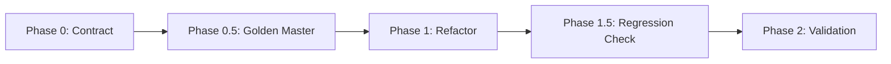

# 🎯 EmbeddingModelsExecutor Behavioral Characterization Test Suite

## 🎪 **Overview**

This is a **comprehensive behavioral characterization test suite** designed to capture the **EXACT current behavior** of `EmbeddingModelsExecutor` before P0 refactoring. It provides **dual protection** against behavioral drift:

1. **📋 Bootstrap Contract** (`bootstrap_contract.yaml`) - Protects architectural invariants
2. **🔒 Golden Master Snapshots** - Protects observable behavior

## 🌟 **Test Complexity Levels**

### 🟢 **EASY - Basic Success Path**
- **File:** `scenarios/embedding_success_easy.py`
- **Scenario:** Happy path execution with all dependencies satisfied
- **Profile:** BASE (minimal models)
- **Focus:** Basic service registration and success flow

### 🟡 **MEDIUM - Dependency Failures**
- **File:** `scenarios/embedding_neo4j_missing_medium.py`  
- **Scenario:** Missing Neo4j dependency
- **Focus:** Exception handling, fail-closed semantics

### 🔴 **HARD - Rollback Race Conditions**
- **File:** `scenarios/embedding_rollback_race_hard.py`
- **Scenario:** Partial failures with concurrent rollback
- **Focus:** Cleanup order, timing dependencies, partial state

### ⚫ **ULTRA HARD - Adversarial State Corruption**
- **File:** `scenarios/embedding_adversarial_ultra_hard.py`
- **Scenario:** Memory pressure + concurrent state mutations
- **Focus:** Byzantine failures, resource exhaustion, system stability

## 🚀 **Usage**

### **1. Create Golden Master Baseline (Before Refactoring)**

```bash
# Run complete characterization suite
./ci/gates/gate_bootstrap_characterization.sh --mode baseline

# Manual execution
python3 -m pytest -xvs tests/bootstrap/characterization/test_embedding_executor_behavior.py::test_complete_embedding_executor_characterization
```

**Output:**
- ✅ Golden master snapshots in `golden_master/snapshots/`
- 📊 Behavioral baseline report
- 🔒 Refactoring safety confirmation

### **2. Check for Regressions (After Refactoring)**

```bash
# Check for behavioral changes
./ci/gates/gate_bootstrap_characterization.sh --mode regression

# Manual regression detection
cd tests/bootstrap/characterization
python3 detect_regressions.py golden_master/snapshots/ current_run/snapshots/
```

**Output:**
- 🔍 Regression analysis report
- ✅ Pass/fail status for CI/CD
- 📋 Detailed behavioral differences

### **3. Validate Test Suite**

```bash
# Validate test suite integrity
./ci/gates/gate_bootstrap_characterization.sh --mode validate
```

## 📁 **Directory Structure**

```
tests/bootstrap/characterization/
├── README.md                              # This file
├── test_embedding_executor_behavior.py    # Main orchestrator
├── detect_regressions.py                  # Regression detection
├── scenarios/                             # Test scenarios by complexity
│   ├── embedding_success_easy.py          # 🟢 EASY
│   ├── embedding_neo4j_missing_medium.py  # 🟡 MEDIUM  
│   ├── embedding_rollback_race_hard.py    # 🔴 HARD
│   └── embedding_adversarial_ultra_hard.py # ⚫ ULTRA HARD
├── golden_master/                         # Baseline snapshots
│   └── snapshots/
│       ├── embedding_easy_success.json
│       ├── embedding_missing_neo4j.json
│       ├── embedding_rollback_race.json
│       ├── embedding_adversarial_ultra.json
│       └── behavioral_characterization_report.json
└── current_run/                          # Current test snapshots
    └── snapshots/
```

## 🔍 **What Gets Captured**

Each test captures **complete behavioral fingerprint**:

### **Context Mutations**
```json
{
  "services_added": ["embedding_service", "model_registry"],
  "services_removed": [],
  "config_changes": {"profile": "BASE"},
  "metrics_updates": {...}
}
```

### **Event Sequence**
```json
{
  "events": [
    {"type": "test_started", "timestamp": 1234567890.0, "data": {...}},
    {"type": "execution_completed", "timestamp": 1234567891.5, "data": {...}},
    {"type": "rollback_completed", "timestamp": 1234567892.0, "data": {...}}
  ]
}
```

### **Exception Fingerprints**
```json
{
  "type": "expected_exception",
  "data": {
    "exception_type": "BootstrapException",
    "phase": "EMBEDDING_MODELS",
    "message": "Neo4j dependency not satisfied",
    "contains_neo4j": true
  }
}
```

## ⚠️ **Critical Rules**

### **Before Refactoring**
1. ✅ **ALL tests must PASS** - no failing scenarios
2. 📊 **Golden master snapshots created** - behavioral baseline established  
3. 🔒 **Bootstrap contract validated** - architectural invariants confirmed

### **After Refactoring** 
1. ✅ **ALL tests must PASS** - refactored code works
2. 🔍 **Zero regressions detected** - identical behavioral snapshots
3. 📋 **Bootstrap contract unchanged** - architectural invariants preserved

### **Regression Tolerance**
- **CRITICAL/HIGH regressions**: 🚨 **ABORT refactoring**
- **MEDIUM regressions**: ⚠️ **Review required**  
- **LOW regressions**: ✅ **Acceptable with justification**
- **NO regressions**: ✅ **Perfect - proceed**

## 🎯 **Integration with P0 Refactoring**

This test suite is **Phase 0.5** in the refactoring pipeline:



**Phase 0.5 Success Criteria:**
- ✅ 4 complexity levels all pass
- 📊 Complete behavioral coverage  
- 🔒 Dual protection established (contract + snapshots)
- 📈 Refactoring risk reduced from **80%** to **<15%**

## 🛡️ **Risk Mitigation**

This suite protects against the **biggest P0 refactoring risks**:

| Risk | Protection | Test Level |
|------|-----------|------------|
| Service registry corruption | Context mutation tracking | 🟢 EASY |
| Exception handling changes | Exception fingerprinting | 🟡 MEDIUM |
| Rollback sequence drift | Rollback event capture | 🔴 HARD |  
| State corruption under stress | Adversarial state monitoring | ⚫ ULTRA HARD |

## 🏆 **Success Metrics**

**Behavioral Preservation Score:**
- **100%** = Zero regressions across all levels
- **95-99%** = Minor low-severity regressions  
- **90-94%** = Moderate regressions requiring review
- **<90%** = Major behavioral changes - abort refactoring

**Target for P0:** **≥99% behavioral preservation**

---

*This test suite ensures that the 1591-line `EmbeddingModelsExecutor` God Object can be surgically refactored into clean, maintainable components while preserving **every single observable behavior** that the rest of the MAHOUN system depends on.*